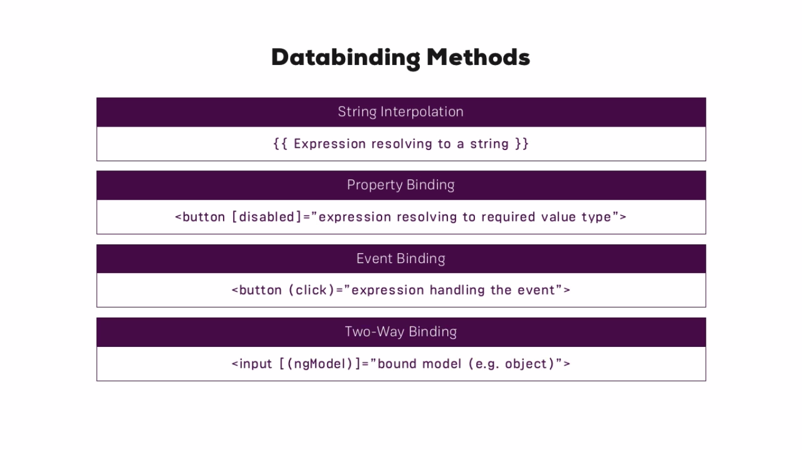
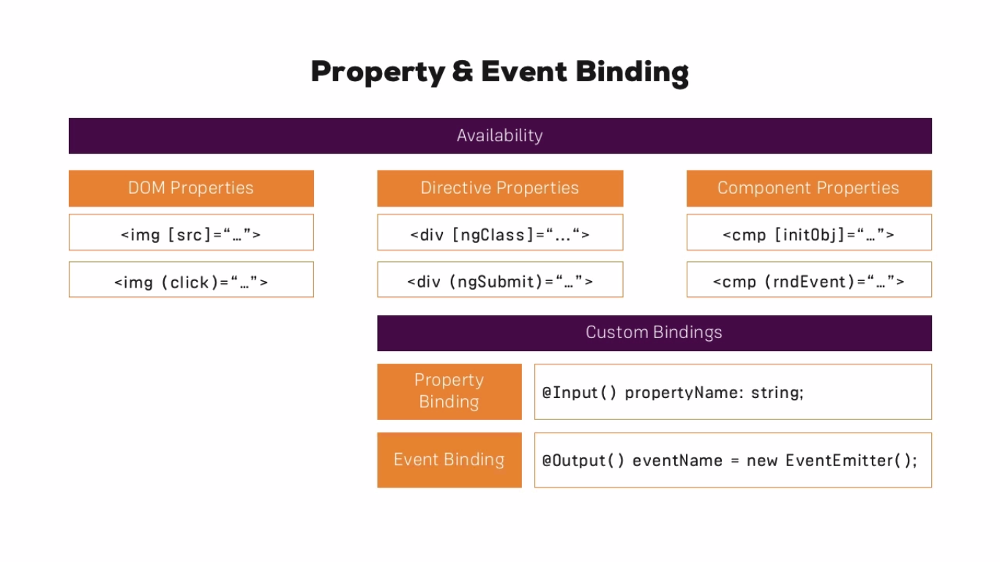
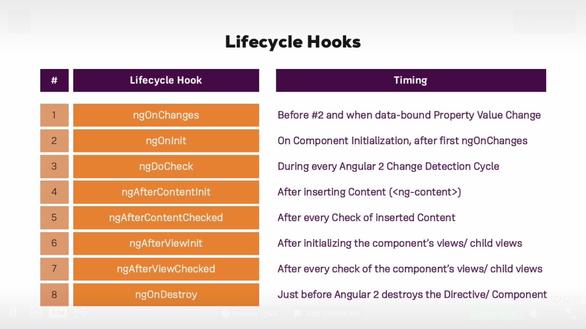

# Initialization

```
index.html
  -> "<app-root>Loading...</app-root>" Has <app-root> in the body to load this component
  -> src/main.ts
    -> "platformBrowserDynamic().bootstrapModule(AppModule);" Initialize the app loading the AppModule
      -> `src/app/app.module.ts` - "@NgModule({bootstrap:[AppComponent]})" The module bootstraps the required components
        -> `src/app/app.component.ts` - "@Component({selector: 'app-root'})" The App component is the one that renders the content on <app-root>
```

# Data Binding Methods



# Property & Event Binding



# Life Cycle Hooks



# Useful directives

## `<ng-content>`

Takes all the HTML Elements inside the component and renders them

```js
// my-conponent
@Component({
  selector: `my-component`
  template: `
    <div>
      <ng-content></ng-content>
    </div>
  `
})
```

```html
<my-component>
  <h1>Hello World</h1>
</my-component>
```
**Result:**

```html
<my-component>
  <div>
    <h1>Hello World</h1>
  </div>
</my-component>
```

# Angular 2 Shadow DOM emulation

_Angular 2_ doesn't use [_Shadow DOM_](http://w3c.github.io/webcomponents/spec/shadow/) form the [_Web Component_](http://webcomponents.org/) specification to style a component.
Instead it uses a _Polyfill_ to add a specific class to the component HTML Elements, and add a selector in the CSS definition.

**Example source:**

```js
@Component({
  template: `<h1>I'm a component</h1>`,
  styles: [`h1 { color: red; }`]
})
```

**Example result:**

```html
<h1 _ngcontent-paw-1="">I'm a component</h1>
```

```css
h1[_ngcontent-paw-1] {
    color: red;
}
```

## Best Practices

* Use a **prefix for components**

# is-cli generator

```bash
ng generate component {component-name}
# Alias
ng g c {component-name}
```
